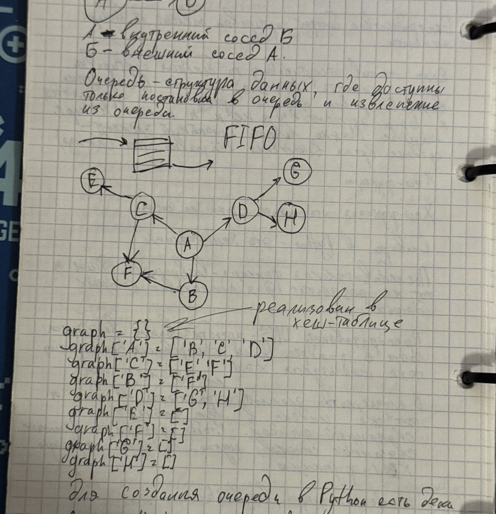
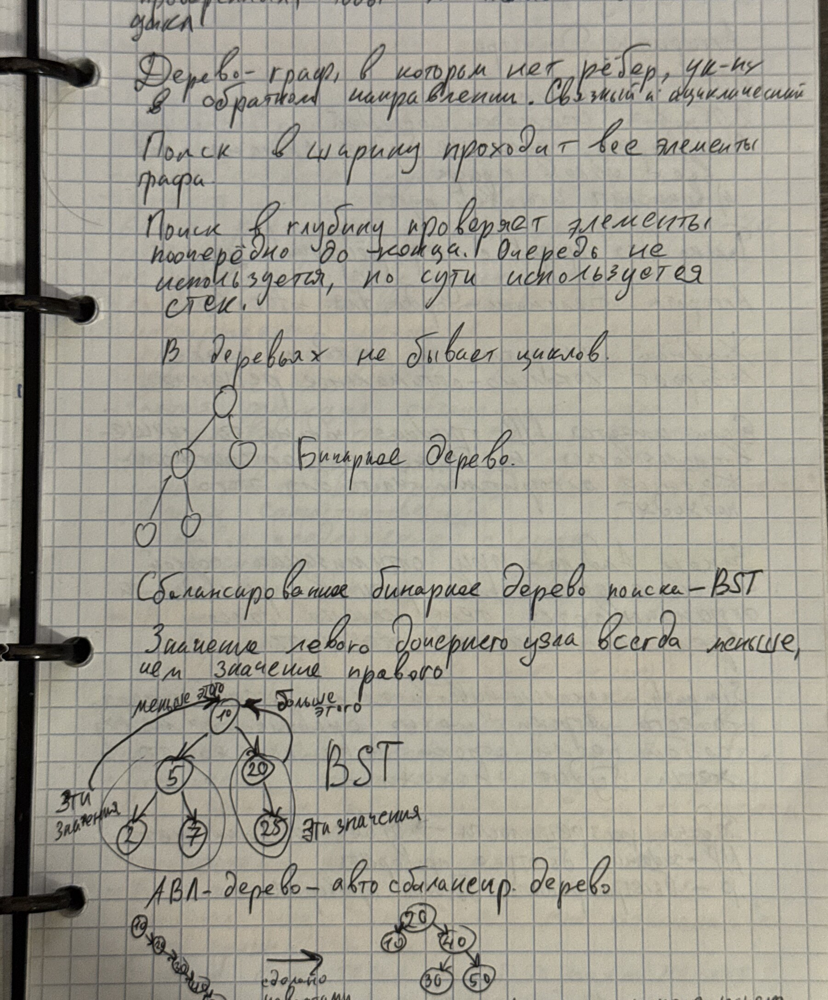

# Алгоритмы и структуры данных

## Оглавление

- [[#Оценка алгоритмов и рекурсия|Оценка алгоритмов и рекурсия]]
- [[#Стек, очередь и связный список|Стек, очередь и связный список]]
- [[#Поиск, хеширование и строки|Поиск, хеширование и строки]]
- [[#Графы|Графы]]
- [[#Деревья|Деревья]]

## Оценка алгоритмов и рекурсия

### Теория

Алгоритм — конечная последовательность однозначных действий для решения класса задач. При сравнении алгоритмов оценивают время и дополнительную память в зависимости от размера входа $n$.

==Асимптотическая сложность показывает скорость роста затрат, а не точное время работы.==

Частые классы: $O(1)$, $O(\log n)$, $O(n)$, $O(n\log n)$, $O(n^2)$ и экспоненциальная сложность. Рекурсивная функция должна иметь базовый случай и переход, приближающий к нему.

### Примеры

Задачу можно разбить на подзадачи, решить их рекурсивно и объединить ответы — принцип «разделяй и властвуй». Так устроены сортировка слиянием и многие алгоритмы на деревьях.

*Источник: IMG_6776 — определение алгоритма, свойства и рекурсивный подход.*

## Стек, очередь и связный список

### Теория

- Стек реализует LIFO: последним добавлен — первым извлечён.
- Очередь реализует FIFO: первым добавлен — первым извлечён.
- В связном списке каждый узел хранит значение и ссылку на следующий узел; вставка после известного узла выполняется за $O(1)$.

### Примеры

Стек используют для обхода в глубину и обработки вызовов функций; очередь — для обхода графа в ширину. Для очереди в Python подходит `collections.deque`, потому что извлечение слева имеет амортизированную сложность $O(1)$.

*Источник: IMG_6777 — связный список, стек и принцип LIFO.*

## Поиск, хеширование и строки

### Теория

Бинарный поиск работает только на отсортированной последовательности: сравнивает искомое значение со средним и на каждом шаге отбрасывает половину диапазона. Сложность — $O(\log n)$.

Хеш-таблица вычисляет индекс по ключу. В среднем поиск, вставка и удаление выполняются за $O(1)$, но возможны коллизии; их разрешают цепочками или открытой адресацией.

Для строковых задач важны нормализация регистра, токенизация, регулярные выражения и аккуратная обработка границ подстроки.

### Примеры

Для поиска слова в отсортированном словаре выгоден бинарный поиск. Для подсчёта частот слов — хеш-таблица `dict`: ключом служит нормализованное слово, значением — количество появлений.

*Источники: IMG_6778 — бинарный поиск и хеширование; IMG_6782–IMG_6783 — обработка строк и выделение совпадений.*

## Графы

### Теория

Граф $G=(V,E)$ состоит из множества вершин $V$ и рёбер $E$. Он может быть ориентированным или неориентированным, взвешенным или невзвешенным. Удобное представление разреженного графа — список смежности.

Обход в ширину (BFS) использует очередь и находит кратчайшие пути в невзвешенном графе. Обход в глубину (DFS) использует стек или рекурсию.

### Примеры



*Фото IMG_6779 — граф, список смежности и очередь для BFS.*

Псевдокод BFS:

```python
from collections import deque

queue = deque([start])
seen = {start}
while queue:
    vertex = queue.popleft()
    for neighbour in graph[vertex]:
        if neighbour not in seen:
            seen.add(neighbour)
            queue.append(neighbour)
```

## Деревья

### Теория

Дерево — связный граф без циклов. В бинарном дереве у узла не более двух потомков. В бинарном дереве поиска значения слева меньше ключа узла, справа — больше; средняя сложность поиска $O(\log n)$, но в вырожденном дереве — $O(n)$.

AVL‑дерево поддерживает баланс высот с помощью поворотов, сохраняя логарифмическую высоту.

### Примеры



*Фото IMG_6780 — BST, порядок поиска и сбалансированное AVL‑дерево.*

*Источник: IMG_6781 — поиск и вставка в BST, ограничения и сложность.*

## Карта источников

| Фото | Содержание |
|---|---|
| IMG_6776 | Понятие алгоритма, сложность, рекурсия |
| IMG_6777 | Связный список, стек, LIFO |
| IMG_6778 | Бинарный поиск и хеширование |
| IMG_6779 | Графы, списки смежности, BFS |
| IMG_6780 | BST и AVL‑деревья |
| IMG_6781 | Поиск/вставка в дереве и сложность |
| IMG_6782 | Алгоритмическая обработка текста |
| IMG_6783 | Продолжение строковой задачи и разбор условий |
