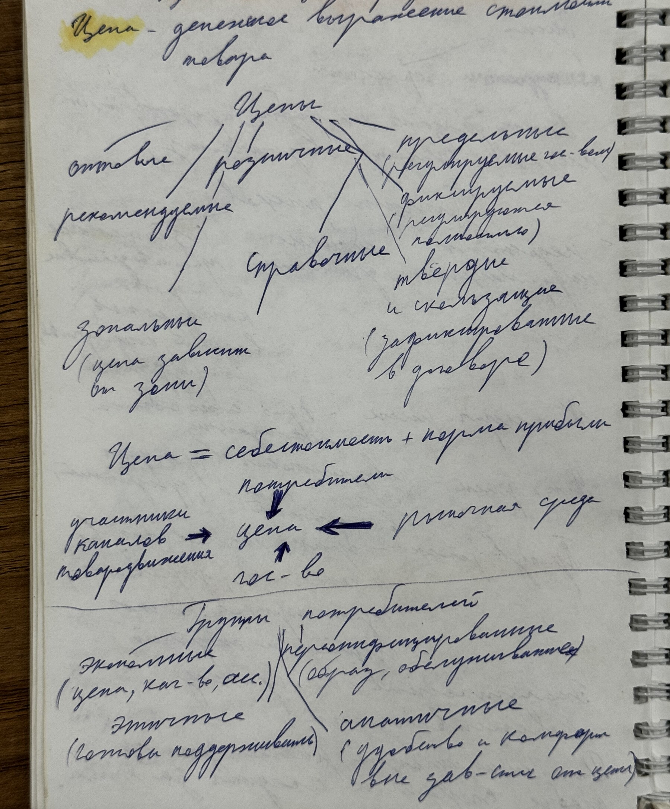
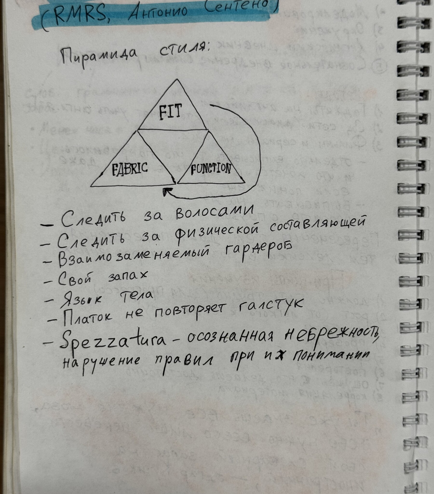
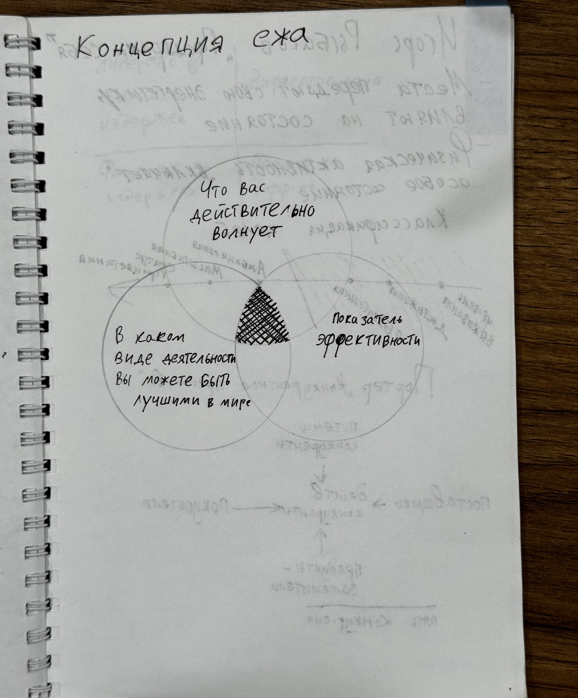
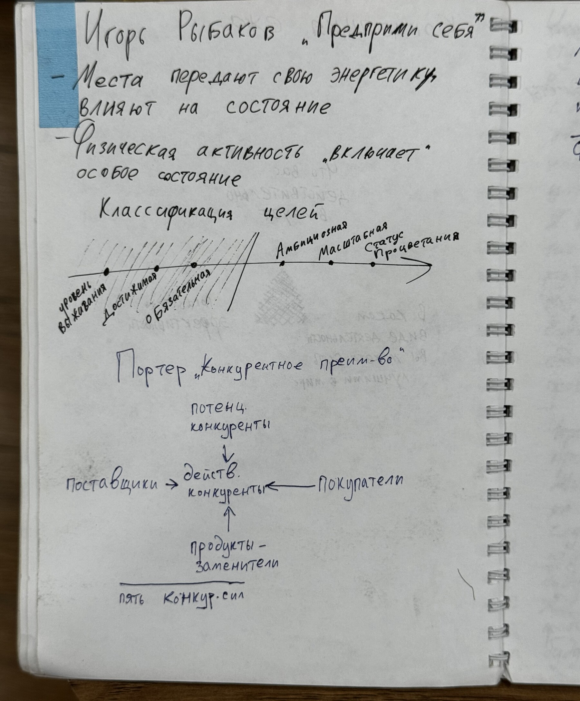
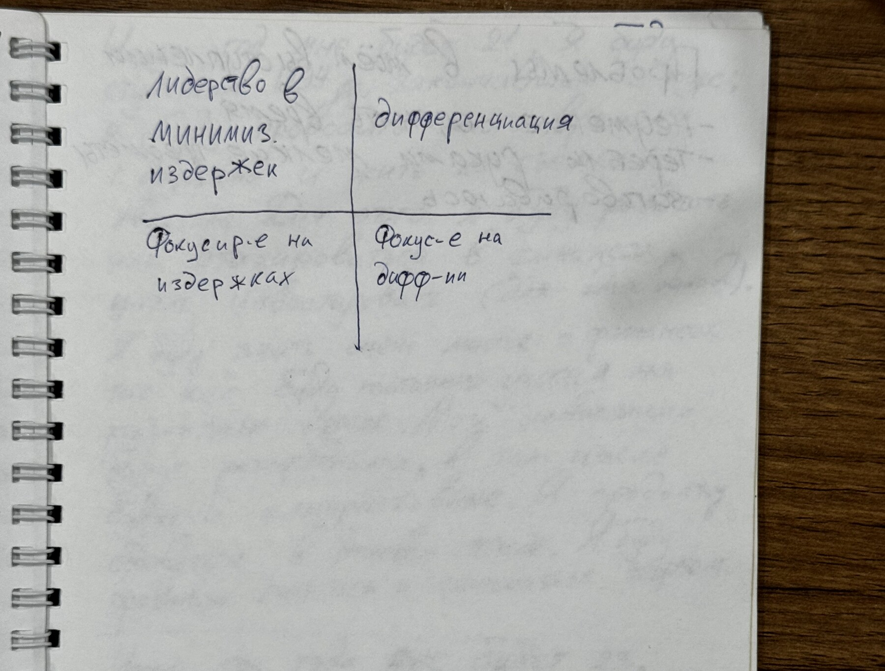

# Капитанская тетрадь

> Материал сгруппирован по темам. Выделенный маркером текст сохранён как `==выделение==`; зачёркнутые записи не включены. Теория отделена от примеров и личных заметок автора.

## Оглавление

- [[#Бизнес-план и финансовая модель|Бизнес-план и финансовая модель]]
- [[#Цели, риски и бизнес-идея|Цели, риски и бизнес-идея]]
- [[#Государство, право и учебное эссе|Государство, право и учебное эссе]]
- [[#Предпринимательство, упаковка и продажи|Предпринимательство, упаковка и продажи]]
- [[#Самоорганизация, мотивация и цели|Самоорганизация, мотивация и цели]]
- [[#Импровизация и публичные выступления|Импровизация и публичные выступления]]
- [[#Английский язык, стиль и спорт|Английский язык, стиль и спорт]]
- [[#Личная стратегия и конкурентные модели|Личная стратегия и конкурентные модели]]
- [[#Информация, привычки и потребности|Информация, привычки и потребности]]

## Бизнес-план и финансовая модель

### Теория

Бизнес-план связывает продукт, рынок, операционную модель, команду, финансы и риски. Финансовый раздел должен разделять разовые затраты открытия, постоянные и переменные расходы, выручку, прибыль и денежный поток.

Точка безубыточности в штуках:

$$
Q_{BE}=\frac{F}{P-V},
$$

где $F$ — постоянные затраты, $P$ — цена единицы, $V$ — переменные затраты на единицу.

==План должен содержать конкретные цифры, сроки и ответственных.==

### Примеры из тетради

Структура бизнес-плана включает резюме, описание предприятия и продукта, анализ рынка и конкурентов, производственный и организационный планы, маркетинг, финансы и риски.

Ежемесячные платежи: аренда, связь и интернет. К затратам открытия отнесены помещение/место, оборудование и материалы. Для инвестиций отмечена необходимость прогноза на первый, второй и третий (пятый) годы, а также оценки платёжеспособности, рентабельности и срока окупаемости.

*Источники: IMG_6492–IMG_6495 — структура бизнес-плана, внутренний/внешний анализ, финансовые показатели и риски; IMG_6497 — постоянные и стартовые расходы.*

## Цели, риски и бизнес-идея

### Теория

Дерево целей раскладывает общую цель на измеримые подцели и задачи. Для каждой ветви полезно указать метрику, срок и зависимость. Риски оценивают по вероятности и воздействию, затем выбирают реакцию: избежать, снизить, передать или принять.

### Примеры из тетради

*Фото IMG_6496 — схема общей цели, подцелей, результатов и ресурсов.*

При выборе бизнес-идеи в тетради предложено учитывать собственные навыки, спрос, доступные ресурсы, каналы продаж и потенциальную прибыль. Отдельно разобраны формы регистрации и действия по запуску.

==Бизнес-идея должна решать конкретную проблему и иметь понятного покупателя.==

*Источники: IMG_6496 — дерево целей; IMG_6498 — бизнес-идея и её проверка; IMG_6499–IMG_6501 — организационно-правовая форма, регистрация и практическое задание.*

## Государство, право и учебное эссе

### Теория

В тетради признаки государства перечислены так: территория, население, суверенитет, публичная власть, система права и налоги. Публичная власть включает аппарат управления и аппарат принуждения.

Судопроизводство записано четырьмя видами: конституционное, уголовное, административное и гражданское. «Система сдержек и противовесов» описана как способность одной ветви власти влиять на другую.

Для ответа по обществознанию используется метод трёх вопросов: «Что это?», «Какое это?», «Для чего это?». План должен содержать минимум три пункта, два из которых конкретизированы.

### Примеры из тетради

==Всегда возвращаться к вопросу.==

Определение должно отличать объект от других объектов, а предложения — соответствовать нормам языка. Для эссе указана кольцевая композиция: введение → тезис «за» → тезис «против» → заключение, возвращающее к исходной задаче.

Выделенные критерии эссе:

- знание основ финансов — 35%;
- содержание — 30%;
- культура речи — 25%;
- метапредметные связи — 10%.

*Источники: IMG_6502–IMG_6503 — государство, власть и право; IMG_6504–IMG_6507 — структура, критерии и стиль эссе; IMG_6508 — метод трёх вопросов и подготовка.*

## Предпринимательство, упаковка и продажи

### Теория

Упаковка продукта должна ясно отвечать: что предлагается, кому, какую проблему решает, чем подтверждается ценность и какое действие требуется от клиента. Продажи строятся вокруг существующей потребности и измеряются конверсией по этапам.

### Примеры из тетради

==Смотреть на всё со стороны возможностей.==

В «Дне тренингов — Мой первый бизнес» отмечены грант как ступень для старта, запись целей и идей, волонтёрство, навыки и ситуация неизбежности как источник мотивации.

Восемь объектов упаковки:

1. продукт;
2. оффер;
3. показатели в цифрах;
4. опыт;
5. площадка;
6. команда;
7. основатель;
8. технологии.

Инструменты продаж: скрипты, вилка цен, конверсия, изменение ассортимента, повышение стоимости, автоворонки, триггеры, упаковка конверторов и звонки отказникам.

==Не продавать новое, а продавать то, что продаётся. Работать только с теми, кому это нужно.==

*Источники: IMG_6510 — предпринимательский тренинг; IMG_6511 — объекты упаковки; IMG_6512 — продажи и инструменты.*

## Самоорганизация, мотивация и цели

### Теория

Самоорганизация включает целеполагание, анализ ситуации, планирование, волевую регуляцию, коррекцию и самоконтроль. Большую цель полезно преобразовывать в ближайшее физическое действие и закреплять конкретным временем.

### Примеры из тетради

Навыки: самодисциплина, управление временем, организация пространства. Анализ ситуации описан как анализ привычек и личных качеств; планирование — как структурирование действий.

Для работы с прокрастинацией записано:

1. приучать себя к дисциплине;
2. отводить прокрастинации определённое время;
3. делить задачи на простые;
4. назначать чёткое время;
5. расставлять приоритеты;
6. использовать мотивацию и вознаграждение;
7. не сердиться при неудаче;
8. развивать терпение и чувство долга.

==Главное правило победителя — не сдаваться и использовать все возможности.==

В «Алгоритме победителя» перечислены цели: образование, своё дело, путешествия, спорт, семья, книга и покупки. Образ будущего: успешный бизнесмен с престижным образованием, путешествующий и уделяющий время семье и спорту.

Драйверы разделены на внешние (коммуникация и окружение) и внутренние (компетенции). Искусственные драйверы — музыка, фильмы, общение и другие заранее выбранные сигналы ресурсного состояния.

*Источники: IMG_6513 — самоорганизация; IMG_6514 — режим и прокрастинация; IMG_6515 — образ цели и способы достижения; IMG_6516–IMG_6517 — цели и доказательства собственных побед; IMG_6518–IMG_6519 — драйверы эффективности.*

## Импровизация и публичные выступления

### Теория

Импровизация опирается на заранее натренированные структуры: ассоциативные цепочки, алфавитные диалоги, истории со случайными словами и раскрытие темы с разных сторон. Для выступления важны начало, паузы, дистанция и невербальное поведение.

### Примеры из тетради

==Главное — начало, так как оно вводит в курс дела.==

Семь правил импровизации:

1. не думать слишком далеко вперёд;
2. идея должна нравиться самому;
3. не сожалеть о сказанном;
4. во время ступора продолжать действовать;
5. заранее готовиться;
6. дать аудитории поверить в спонтанность;
7. регулярно практиковаться.

Инструменты: цепочка из пяти ассоциаций, рассказ по алфавиту, несуществующие города/вузы, история с заданными словами. Упражнение на память: произнести фразу правильно, затем слова в обратном порядке, затем всё наоборот.

По Карнеги: начинать с сильного желания достичь цели, глубоко знать предмет, записывать собственные идеи и опыт, а к источникам обращаться после исчерпания своих мыслей.

*Источники: IMG_6521 — импровизация и ассоциации; IMG_6522 — инструментарий; IMG_6523 — память; IMG_6528 — правила публичного выступления по Карнеги.*

## Английский язык, стиль и спорт

### Теория

Для языка нужны словарный запас, грамматика, чтение, аудирование, письмо и говорение. Эффективное обучение сочетает контекст, интервальное повторение и активное применение.

### Примеры из тетради

Методы английского: интерфейсы на английском, общение, фильмы и сериалы с паузами, выписывание выражений, дневник и сознательное внедрение слов и грамматики. Отмечены англо-английские словари Macmillan, Cambridge и Oxford.

==Ты уже знаешь все нужные слова; нужно перевести свой словарный запас на иностранный.==

*Фото IMG_6526 — пирамида FIT–FABRIC–FUNCTION и правила стиля.*

Подготовка к марафону: беговая база в I–II пульсовых зонах, сон, плавание, четыре тренировки по 1–1,5 часа, силовые/темповые работы 1–2 раза в неделю, сложные углеводы, целевое время, проверка питания и экипировки на тренировках.

*Источники: IMG_6524–IMG_6525 — изучение английского; IMG_6526 — стиль; IMG_6527 — подготовка к марафону.*

## Личная стратегия и конкурентные модели

### Теория

«Концепция ежа» ищет пересечение трёх вопросов: что действительно волнует, в чём можно быть лучшим и какой показатель отражает эффективность.

*Фото IMG_6529 — три пересекающихся круга концепции ежа.*

Пять конкурентных сил Портера: действующие конкуренты, потенциальные участники, поставщики, покупатели и продукты-заменители.

*Фото IMG_6530 — классификация целей и схема пяти конкурентных сил.*

Конкурентные стратегии:

*Фото IMG_6531 — лидерство в издержках, дифференциация и два варианта фокусирования.*

### Примеры из тетради

Классификация целей идёт от выживания через достойный и обеспеченный уровни к амбициозной, масштабной цели и статусу процветания. Отмечено влияние мест и физической активности на состояние.

*Источники: IMG_6529 — концепция ежа; IMG_6530 — Игорь Рыбаков, классификация целей и пять сил; IMG_6531 — конкурентные стратегии.*

## Информация, привычки и потребности

### Теория

Перед сохранением информации полезно проверить её долговечность, учебную цель и место в системе знаний. Привычка описывается циклом «сигнал → рутина → награда»; изменение начинается с выявления реальной награды и замены рутины.

### Примеры из тетради

Фильтр информации:

1. будет ли это актуально через десять лет;
2. чему я учусь;
3. курсы «Универсариум» и OpenEdu;
4. тематические плейлисты;
5. база данных;
6. майндкарты.

==Определённость, разнообразие, значимость, любовь/связь, развитие и вклад — шесть человеческих потребностей.==

Личные правила включают планирование дня перед сном, чтение, физическую активность, молитву при сомнениях, отсутствие телефона в туалете и замену нежелательной рутины заранее выбранными действиями. Выделенные автором стимулы и система награды сохранены по смыслу.

*Источники: IMG_6532 — поглощение информации; IMG_6533 — цикл «сигнал — рутина — награда»; IMG_6534 — новые правила; IMG_6535 — шесть потребностей; IMG_6536–IMG_6537 — дизайн и продажа продуктов; IMG_6538 — список литературы.*

## Карта источников

| Фото | Содержание |
|---|---|
| IMG_6492 | Структура бизнес-плана |
| IMG_6493 | Внутренние и внешние факторы |
| IMG_6494 | Финансовые показатели и окупаемость |
| IMG_6495 | Риски проекта |
| IMG_6496 | Дерево целей |
| IMG_6497 | Постоянные и стартовые расходы |
| IMG_6498 | Проверка бизнес-идеи |
| IMG_6499 | Формы бизнеса и регистрация |
| IMG_6500 | Документы и шаги регистрации |
| IMG_6501 | Практическое задание |
| IMG_6502 | Признаки государства и публичная власть |
| IMG_6503 | Право, судопроизводство и определения |
| IMG_6504 | План учебного ответа и эссе |
| IMG_6505 | Критерии содержания эссе |
| IMG_6506 | Речь, композиция и редактирование |
| IMG_6507 | Навыки публичного выступления |
| IMG_6508 | Метод трёх вопросов |
| IMG_6509 | Метод рычага |
| IMG_6510 | «Мой первый бизнес» |
| IMG_6511 | Восемь объектов упаковки |
| IMG_6512 | Продажи и инструменты |
| IMG_6513 | Самоорганизация |
| IMG_6514 | Режим и прокрастинация |
| IMG_6515 | Образ цели и способы достижения |
| IMG_6516 | Алгоритм победителя |
| IMG_6517 | Сильные стороны и победы |
| IMG_6518 | Внешние и внутренние драйверы |
| IMG_6519 | Позитивный настрой и поддержка окружения |
| IMG_6521 | Импровизация и ассоциативные ряды |
| IMG_6522 | Инструментарий импровизации |
| IMG_6523 | Упражнение на память |
| IMG_6524 | Составляющие изучения английского |
| IMG_6525 | Методы и принципы изучения языка |
| IMG_6526 | Стиль и пирамида FIT–FABRIC–FUNCTION |
| IMG_6527 | Подготовка к марафону |
| IMG_6528 | Публичные выступления по Карнеги |
| IMG_6529 | Концепция ежа |
| IMG_6530 | Классификация целей и пять сил Портера |
| IMG_6531 | Конкурентные стратегии |
| IMG_6532 | Поглощение информации |
| IMG_6533 | Сигнал, рутина и награда |
| IMG_6534 | Новые правила и система награды |
| IMG_6535 | Шесть человеческих потребностей |
| IMG_6536 | Дизайн футболок и продажа |
| IMG_6537 | Площадки и рабочие заметки |
| IMG_6538 | Подборка книг и заметки |

> В исходном архиве отсутствует IMG_6520; это зафиксировано как пропуск нумерации, а не как потерянная при обработке страница.
