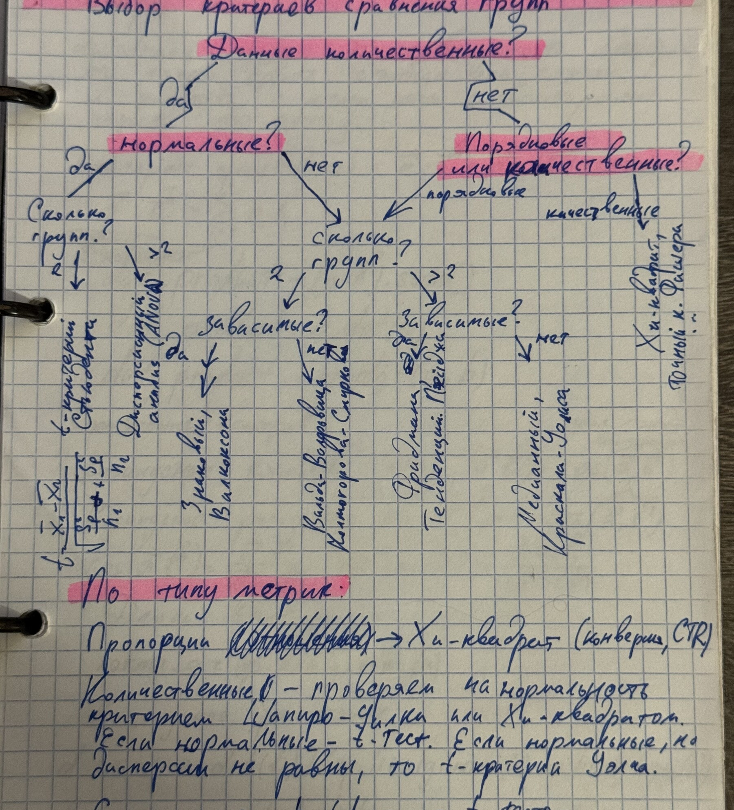

# Анализ данных и машинное обучение

## Оглавление

- [[#Деревья решений|Деревья решений]]
- [[#Векторы, расстояния и матрицы|Векторы, расстояния и матрицы]]
- [[#Линейная регрессия и метрики|Линейная регрессия и метрики]]
- [[#Подготовка признаков|Подготовка признаков]]
- [[#Логистическая регрессия и классификация|Логистическая регрессия и классификация]]
- [[#Матрица ошибок и метрики классификации|Матрица ошибок и метрики классификации]]
- [[#SQLAlchemy и пользовательские функции|SQLAlchemy и пользовательские функции]]
- [[#SVM, регуляризация и ядра|SVM, регуляризация и ядра]]
- [[#KNN, ROC–AUC и дисбаланс классов|KNN, ROC–AUC и дисбаланс классов]]

## Деревья решений

### Теория

Дерево решений последовательно делит пространство признаков по условиям. Для классификации листья содержат класс или вероятности классов, для регрессии — числовой прогноз.

==Глубина дерева контролирует компромисс между недообучением и переобучением.==

Критерии разбиения стремятся уменьшить неоднородность дочерних узлов: Gini/entropy для классификации и уменьшение дисперсии или MSE для регрессии.

### Примеры



*Фото IMG_6749 — дерево выбора метода и заметки о дереве решений.*

```python
from sklearn.tree import DecisionTreeClassifier

model = DecisionTreeClassifier(max_depth=4, random_state=42)
model.fit(X_train, y_train)
```

*Источник: IMG_6749 — классификация/регрессия, ветвление и дерево решений.*

## Векторы, расстояния и матрицы

### Теория

Скалярное произведение:

$$
a\cdot b=\sum_i a_i b_i=\lVert a\rVert\lVert b\rVert\cos\theta.
$$

Евклидово расстояние и косинусная близость:

$$
d_2(a,b)=\sqrt{\sum_i(a_i-b_i)^2},\qquad
\cos(a,b)=\frac{a\cdot b}{\lVert a\rVert\lVert b\rVert}.
$$

Произведение матриц определено, если число столбцов первой матрицы равно числу строк второй. Для решения линейных задач используются транспонирование, определитель, обратная матрица и псевдообратная матрица.

### Примеры

```python
import numpy as np

dot = np.dot(a, b)
distance = np.linalg.norm(a - b)
cosine = dot / (np.linalg.norm(a) * np.linalg.norm(b))
product = A @ B
inverse = np.linalg.inv(A)
pseudoinverse = np.linalg.pinv(A)
```

*Источники: IMG_6750 — расстояния и скалярное произведение; IMG_6751–IMG_6753 — массивы NumPy, матричное умножение, определитель, обратная и псевдообратная матрицы.*

## Линейная регрессия и метрики

### Теория

Линейная регрессия моделирует

$$
\hat y=Xw,
$$

а метод наименьших квадратов минимизирует сумму квадратов остатков. При полном ранге:

$$
\hat w=(X^TX)^{-1}X^Ty.
$$

Основные метрики:

$$
MAE=\frac1n\sum_i|y_i-\hat y_i|,
$$

$$
MSE=\frac1n\sum_i(y_i-\hat y_i)^2,\qquad RMSE=\sqrt{MSE},
$$

$$
R^2=1-\frac{\sum_i(y_i-\hat y_i)^2}{\sum_i(y_i-\bar y)^2}.
$$

==MAE устойчивее к единичным крупным ошибкам, а MSE/RMSE сильнее штрафуют выбросы.==

### Примеры

```python
from sklearn.metrics import mean_absolute_error, mean_squared_error, r2_score

mae = mean_absolute_error(y_test, y_pred)
mse = mean_squared_error(y_test, y_pred)
r2 = r2_score(y_test, y_pred)
```

Остатки $e_i=y_i-\hat y_i$ проверяют на структуру: систематический рисунок указывает на пропущенную нелинейность, неодинаковую дисперсию или другие нарушения модели.

*Источники: IMG_6753–IMG_6754 — формула МНК, MAE, MSE, RMSE и $R^2$.*

## Подготовка признаков

### Теория

Масштабирование особенно важно для моделей, зависящих от расстояния или штрафа коэффициентов. Стандартизация:

$$
z=\frac{x-\mu}{\sigma}.
$$

Номинальные категории кодируют one-hot-признаками; порядковые категории допускают ordinal encoding только при содержательном порядке.

==Кодировщик и scaler обучают только на train, затем применяют к validation/test.==

Данные разделяют до обучения всех преобразований, чтобы не допустить утечку информации.

### Примеры

```python
from sklearn.model_selection import train_test_split
from sklearn.preprocessing import StandardScaler, OneHotEncoder

X_train, X_test, y_train, y_test = train_test_split(
    X, y, test_size=0.2, random_state=42, stratify=y
)
scaler = StandardScaler().fit(X_train_num)
X_train_scaled = scaler.transform(X_train_num)
X_test_scaled = scaler.transform(X_test_num)
```

*Источники: IMG_6754–IMG_6756 — масштабирование, нормализация, one-hot/label encoding, остатки и train/test split.*

## Логистическая регрессия и классификация

### Теория

Логистическая регрессия оценивает вероятность положительного класса:

$$
p(y=1\mid x)=\sigma(w_0+w^Tx),\qquad
\sigma(z)=\frac{1}{1+e^{-z}}.
$$

Логарифм отношения шансов линеен по признакам:

$$
\log\frac{p}{1-p}=w_0+w^Tx.
$$

Для нескольких классов используют multinomial/softmax или схему One-vs-Rest.

### Примеры

```python
from sklearn.linear_model import LogisticRegression

model = LogisticRegression(max_iter=1000)
model.fit(X_train, y_train)
proba = model.predict_proba(X_test)
pred = model.predict(X_test)
```

*Источники: IMG_6757 — accuracy и логистическая регрессия; IMG_6758 — odds/log-odds и многоклассовая схема.*

## Матрица ошибок и метрики классификации

### Теория

Матрица ошибок содержит $TP$, $TN$, $FP$, $FN$:

$$
accuracy=\frac{TP+TN}{TP+TN+FP+FN},
$$

$$
precision=\frac{TP}{TP+FP},\qquad
recall=\frac{TP}{TP+FN},
$$

$$
F_1=2\frac{precision\cdot recall}{precision+recall}.
$$

==Accuracy может вводить в заблуждение при сильном дисбалансе классов.==

### Примеры

```python
from sklearn.metrics import confusion_matrix, classification_report

cm = confusion_matrix(y_test, pred)
print(classification_report(y_test, pred))
```

*Источники: IMG_6759 — confusion matrix; IMG_6764 — precision, recall и визуализация областей решений.*

## SQLAlchemy и пользовательские функции

### Теория

ORM связывает таблицы базы с классами Python. Для безопасной работы используют параметризованные запросы и управляют транзакциями явно.

Пользовательские функции PostgreSQL различаются по изменчивости:

- `IMMUTABLE` — одинаковый результат при одинаковых аргументах;
- `STABLE` — неизменен внутри одного запроса;
- `VOLATILE` — может меняться при каждом вызове.

==Уровень изменчивости функции влияет на допустимые оптимизации запросов.==

### Примеры

```python
from sqlalchemy.orm import declarative_base, sessionmaker

Base = declarative_base()
Session = sessionmaker(bind=engine)
session = Session()
```

В SQL функция объявляется через `CREATE OR REPLACE FUNCTION`, тип результата, тело, язык и категорию изменчивости.

*Источники: IMG_6760–IMG_6763 — подключение, SQLAlchemy ORM, запросы, UDF и PL/Python.*

## SVM, регуляризация и ядра

### Теория

SVM выбирает разделяющую гиперплоскость с максимальным зазором. Опорные векторы лежат ближе всего к границе и определяют её положение.

Параметр $C$ задаёт компромисс: большое $C$ сильнее штрафует ошибки, малое — допускает больше нарушений ради широкого зазора. Ядерный трюк позволяет строить нелинейные границы:

- linear;
- polynomial;
- RBF/Gaussian;
- sigmoid.

Регуляризация уменьшает переобучение:

$$
L_2: \quad L(w)+\lambda\lVert w\rVert_2^2,
$$

$$
L_1: \quad L(w)+\lambda\lVert w\rVert_1.
$$

==Рост регуляризации обычно увеличивает смещение и уменьшает дисперсию.==

### Примеры

```python
from sklearn.svm import SVC

model = SVC(kernel="rbf", C=1.0, gamma="scale", probability=True)
model.fit(X_train, y_train)
```

*Источники: IMG_6765–IMG_6768 — SVM, margin, kernels, $C$, регуляризация, bias–variance.*

## KNN, ROC–AUC и дисбаланс классов

### Теория

KNN присваивает объекту класс большинства среди $k$ ближайших соседей. Метод чувствителен к масштабу признаков и выбору расстояния.

ROC‑кривая показывает $TPR$ против $FPR$ при изменении порога:

$$
TPR=\frac{TP}{TP+FN},\qquad FPR=\frac{FP}{FP+TN}.
$$

ROC–AUC интерпретируется как способность ранжировать случайный положительный объект выше случайного отрицательного. При редком положительном классе полезно дополнительно смотреть PR‑кривую.

Способы работы с дисбалансом:

- стратифицированное разбиение;
- веса классов;
- undersampling/oversampling;
- SMOTE и ADASYN только внутри train-части или fold кросс‑валидации;
- метрики precision, recall, $F_1$, PR–AUC.

==Ресемплинг до train/test split создаёт утечку и завышает качество.==

### Примеры

```python
from sklearn.neighbors import KNeighborsClassifier
from sklearn.metrics import roc_auc_score

knn = KNeighborsClassifier(n_neighbors=5).fit(X_train, y_train)
score = roc_auc_score(y_test, knn.predict_proba(X_test)[:, 1])
```

*Источники: IMG_6769 — KNN и $F_1$; IMG_6770–IMG_6772 — ROC, AUC и пороги; IMG_6773 — dummy classifier и дисбаланс; IMG_6774–IMG_6775 — стратификация, oversampling, SMOTE и ADASYN.*

## Карта источников

| Фото | Содержание |
|---|---|
| IMG_6749 | Выбор типа задачи и дерево решений |
| IMG_6750 | Векторы, расстояния, скалярное произведение |
| IMG_6751 | Массивы и матричные операции NumPy |
| IMG_6752 | Определитель, обратная матрица, транспонирование |
| IMG_6753 | Псевдообратная матрица, МНК и ошибки регрессии |
| IMG_6754 | MAE, MSE, $R^2$, подготовка признаков |
| IMG_6755 | Scaling и one-hot encoding |
| IMG_6756 | Encoding, остатки и train/test split |
| IMG_6757 | Accuracy и логистическая регрессия |
| IMG_6758 | Odds, log-odds и multiclass |
| IMG_6759 | Матрица ошибок |
| IMG_6760 | SQL и подключение к БД |
| IMG_6761 | SQLAlchemy ORM |
| IMG_6762 | Запросы и пользовательские функции |
| IMG_6763 | Функции PostgreSQL и PL/Python |
| IMG_6764 | Precision, recall, decision regions |
| IMG_6765 | SVM и максимальный зазор |
| IMG_6766 | Ядра SVM |
| IMG_6767 | Регуляризация и bias–variance |
| IMG_6768 | SVM/регрессия и коэффициенты модели |
| IMG_6769 | KNN и $F_1$ |
| IMG_6770 | $F_\beta$, TPR/FPR и ROC |
| IMG_6771 | ROC display и multiclass metrics |
| IMG_6772 | ROC–AUC и KNN |
| IMG_6773 | Дисбаланс и dummy classifier |
| IMG_6774 | Стратификация и ресемплинг |
| IMG_6775 | SMOTE и ADASYN |
