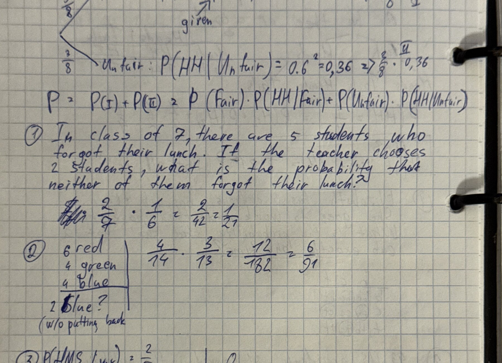
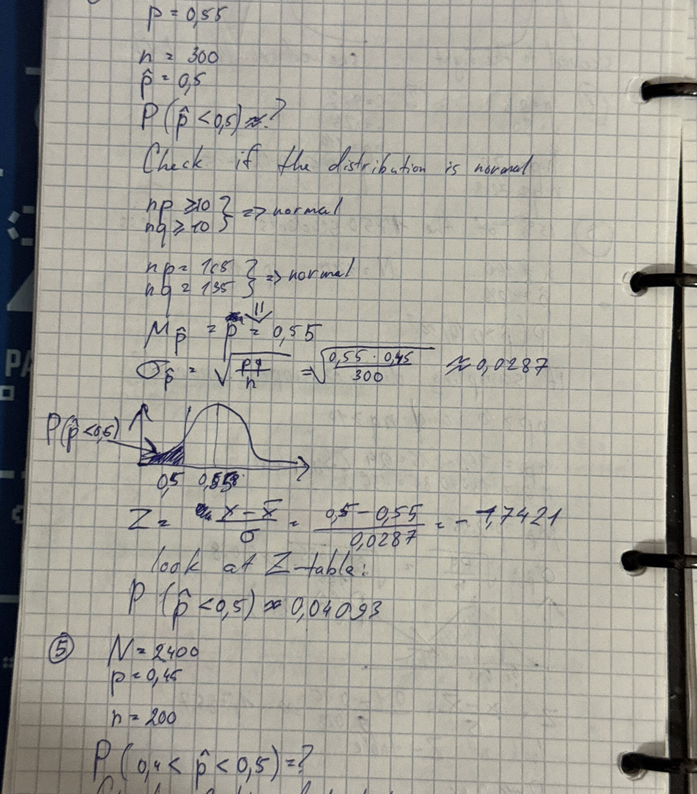
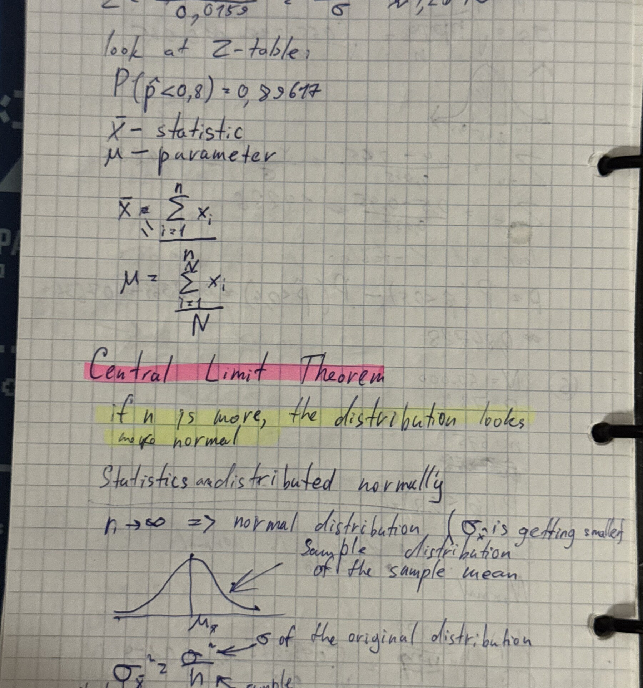
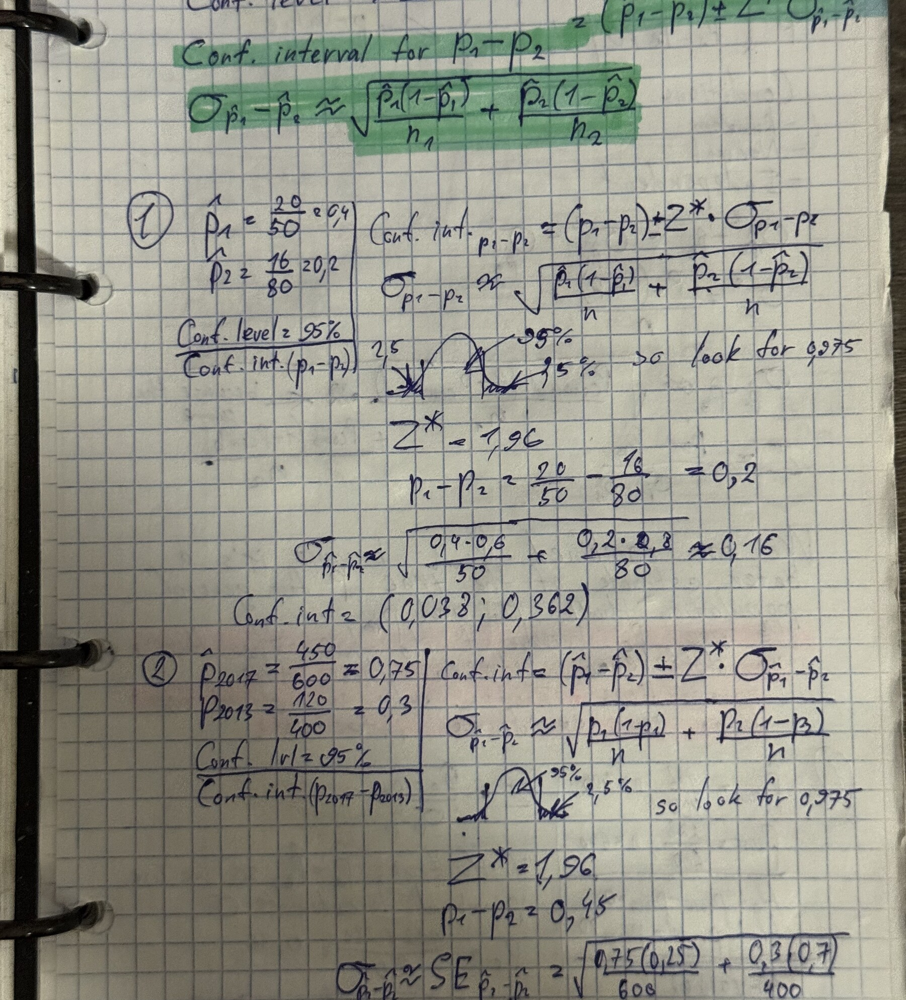

# Khan Academy Statistics and Probability

> This notebook is kept in English. Highlighted definitions from the source are preserved with Obsidian `==highlighting==`.

## Contents

- [[#Descriptive statistics and z-scores|Descriptive statistics and z-scores]]
- [[#Sampling methods and study design|Sampling methods and study design]]
- [[#Probability rules|Probability rules]]
- [[#Conditional probability and Bayes' theorem|Conditional probability and Bayes' theorem]]
- [[#Permutations and combinations|Permutations and combinations]]
- [[#Random variables and expected value|Random variables and expected value]]
- [[#Binomial and geometric distributions|Binomial and geometric distributions]]
- [[#Sampling distributions and the Central Limit Theorem|Sampling distributions and the Central Limit Theorem]]
- [[#Confidence intervals|Confidence intervals]]
- [[#Significance tests|Significance tests]]
- [[#Comparing two populations|Comparing two populations]]
- [[#Chi-square tests|Chi-square tests]]

## Descriptive statistics and z-scores

### Theory

The z-score measures how many standard deviations an observation is from the mean:

$$
z=\frac{x-\mu}{\sigma}.
$$

==A z-score is the number of standard deviations a value is above or below the mean.==

For a normal distribution, approximately 68%, 95%, and 99.7% of observations fall within one, two, and three standard deviations of the mean. A percentile is the percentage of observations at or below a value. The interquartile range is

$$
IQR=Q_3-Q_1.
$$

### Examples

To find the proportion below $x$, calculate $z$ and read $P(Z\le z)$ from a standard normal table. For a right-tail probability use $1-P(Z\le z)$; for an interval subtract two cumulative probabilities.

*Sources: IMG_6794 — z-scores; IMG_6795 — percentiles, IQR and sampling terminology; IMG_6796 — normal distribution and the empirical rule; IMG_6797–IMG_6803 — z-table exercises and normal probabilities; IMG_6804 — mean, variance, parameter and statistic.*

## Sampling methods and study design

### Theory

==A random sample gives every individual a known chance of selection.==

Common designs:

- simple random sample;
- stratified sample: sample within relevant subgroups;
- cluster sample: randomly choose whole clusters;
- systematic sample: select every $k$th unit after a random start;
- matched pairs/block design: compare treatments within similar units.

Observational studies record existing conditions; experiments deliberately assign treatments. Random assignment supports causal inference, while random sampling supports generalization to a population.

### Examples

A study can be representative without being experimental, and experimental without being representative. Identify whether the question is about causality or population generalization before choosing the design.

*Source: IMG_6795 — random, stratified, cluster and systematic sampling; matched-pairs and observational/experimental designs.*

## Probability rules

### Theory

For events $A$ and $B$:

$$
P(A^c)=1-P(A),
$$

$$
P(A\cup B)=P(A)+P(B)-P(A\cap B).
$$

If $A$ and $B$ are disjoint, $P(A\cap B)=0$. If they are independent,

$$
P(A\cap B)=P(A)P(B).
$$

==Disjoint events are not independent unless one of them has probability zero.==

### Examples

*Photo IMG_6808 — universal set, complements, intersections, unions and card examples.*

For repeated independent trials, multiply probabilities along one sequence and add probabilities across mutually exclusive sequences.

*Sources: IMG_6805–IMG_6808 — introductory probability, sets, complements, unions and intersections.*

## Conditional probability and Bayes' theorem

### Theory

$$
P(A\mid B)=\frac{P(A\cap B)}{P(B)}.
$$

The multiplication rule is

$$
P(A\cap B)=P(A\mid B)P(B).
$$

Bayes' theorem:

$$
P(A\mid B)=\frac{P(B\mid A)P(A)}{P(B)}.
$$

==Independence means $P(A\mid B)=P(A)$, not that the events cannot occur together.==

### Examples

Use a tree diagram or two-way table when probabilities are conditional. For medical testing, combine sensitivity with the base rate; a high sensitivity alone does not determine the probability of actually having the condition after a positive result.

*Sources: IMG_6809 — conditional probability and Bayes; IMG_6810–IMG_6812 — tree/table exercises and tests for independence.*

## Permutations and combinations

### Theory

Use permutations when order matters and combinations when it does not:

$$
{}_nP_r=\frac{n!}{(n-r)!},\qquad
{n\choose r}=\frac{n!}{r!(n-r)!}.
$$

For repeated objects, divide by the factorials of repeated counts.

==Permutation: order matters. Combination: order does not matter.==

### Examples

Arranging $r$ students in distinct positions uses ${}_nP_r$. Choosing a committee uses ${n\choose r}$. A word with repeated letters uses $n!/(n_1!n_2!\cdots)$.

*Sources: IMG_6813–IMG_6814 — permutations and combinations; IMG_6815–IMG_6819 — arrangements, card selections, repeated letters and counting exercises.*

## Random variables and expected value

### Theory

For a discrete random variable $X$:

$$
E(X)=\mu_X=\sum_x xP(X=x),
$$

$$
\operatorname{Var}(X)=\sum_x(x-\mu_X)^2P(X=x),\qquad
\sigma_X=\sqrt{\operatorname{Var}(X)}.
$$

Linear transformations obey

$$
E(aX+b)=aE(X)+b,qquad
\operatorname{Var}(aX+b)=a^2\operatorname{Var}(X).
$$

For independent random variables,

$$
\operatorname{Var}(X\pm Y)=\operatorname{Var}(X)+\operatorname{Var}(Y).
$$

### Examples

An expected value is a long-run average, not necessarily a possible single outcome. Adding a constant changes the mean but not the variance; multiplying by $a$ multiplies the standard deviation by $|a|$.

*Sources: IMG_6820–IMG_6821 — expected value, variance and transformations; IMG_6822–IMG_6823 — sums/differences of random variables and applied examples.*

## Binomial and geometric distributions

### Theory

For $X\sim Bin(n,p)$:

$$
P(X=k)={n\choose k}p^k(1-p)^{n-k},qquad
E(X)=np,qquad \sigma_X=\sqrt{np(1-p)}.
$$

==Binomial conditions: fixed number of trials, two outcomes, independence and constant probability of success.==

For the number of trials until the first success, $X\sim Geo(p)$:

$$
P(X=k)=(1-p)^{k-1}p,qquad E(X)=\frac1p,qquad
\sigma_X=\frac{\sqrt{1-p}}{p}.
$$

==Geometric trials continue until the first success; the number of trials is not fixed.==

### Examples

For “exactly $k$ successes,” use the binomial mass function. For “at least one success,” the complement $1-P(X=0)$ is often simpler. For “first success on trial $k$,” use the geometric formula.

*Sources: IMG_6828–IMG_6831 — binomial probability, mean and standard deviation; IMG_6832–IMG_6837 — geometric distribution and waiting-time problems.*

*Photo IMG_6840 — distribution sketches and relationships among Bernoulli, binomial and normal models.*

## Sampling distributions and the Central Limit Theorem

### Theory

For the sample mean:

$$
E(\bar X)=\mu,\qquad
\sigma_{\bar X}=\frac{\sigma}{\sqrt n}.
$$

For the sample proportion:

$$
E(\hat p)=p,\qquad
\sigma_{\hat p}=\sqrt{\frac{p(1-p)}{n}}.
$$

The 10% condition supports approximate independence when sampling without replacement: $n\le0.1N$. For proportions, normal approximation commonly requires $np\ge10$ and $n(1-p)\ge10$.

==If the sample size is sufficiently large, the sampling distribution of the mean is approximately normal even when the population is not normal.==

### Examples

*Photo IMG_6842 — the Central Limit Theorem and the shrinking standard error of the sample mean.*

*Sources: IMG_6838–IMG_6841 — sampling distributions and normal approximation; IMG_6842 — CLT; IMG_6843–IMG_6845 — probability exercises for sample means and proportions.*

## Confidence intervals

### Theory

General form:

$$
\text{estimate}\pm(\text{critical value})(\text{standard error}).
$$

For one proportion:

$$
\hat p\pm z^*\sqrt{\frac{\hat p(1-\hat p)}{n}}.
$$

For one mean when $\sigma$ is unknown:

$$
\bar x\pm t^*\frac{s}{\sqrt n},\qquad df=n-1.
$$

==A 95% confidence procedure captures the true parameter in about 95% of repeated samples; the parameter is fixed.==

Increasing confidence widens the interval; increasing sample size narrows it. The margin of error is the critical value times the standard error.

### Examples

Before using a one-proportion interval, check randomness, independence/10% and large counts based on observed successes and failures. Report the interval in context, including the population and parameter.

*Sources: IMG_6846 — interval conditions and standard error; IMG_6847 — margin of error and interpretation; IMG_6848–IMG_6850 — confidence-interval exercises and required sample size.*

## Significance tests

### Theory

Specify $H_0$, $H_a$, a significance level $\alpha$ and a test statistic. The p-value is the probability, assuming $H_0$, of obtaining a result at least as extreme as the observed one.

==If $p\le\alpha$, reject $H_0$; otherwise fail to reject $H_0$. Do not say that $H_0$ has been proved.==

For one proportion:

$$
z=\frac{\hat p-p_0}{\sqrt{p_0(1-p_0)/n}}.
$$

For one mean:

$$
t=\frac{\bar x-\mu_0}{s/\sqrt n}.
$$

Type I error: reject a true $H_0$; probability $\alpha$. Type II error: fail to reject a false $H_0$; probability $\beta$. Power is $1-\beta$.

*Photo IMG_6857 — rejection regions, Type I/II errors, significance and power.*

### Examples

Choose a one-sided alternative only when the direction was specified before seeing data. A two-sided p-value includes extremes in both tails.

*Sources: IMG_6851–IMG_6852 — hypotheses and significance level; IMG_6853–IMG_6856 — one- and two-sided z-tests and p-values; IMG_6857 — errors and power; IMG_6862–IMG_6864 — z/t statistics and one-sample tests.*

## Comparing two populations

### Theory

For two independent proportions, a confidence interval uses

$$
(\hat p_1-\hat p_2)\pm z^*\sqrt{\frac{\hat p_1(1-\hat p_1)}{n_1}+\frac{\hat p_2(1-\hat p_2)}{n_2}}.
$$

Under $H_0:p_1=p_2$, the test statistic uses the pooled proportion

$$
\hat p_c=\frac{x_1+x_2}{n_1+n_2}.
$$

For two independent means, Welch's statistic is

$$
t=\frac{\bar x_1-\bar x_2}{\sqrt{s_1^2/n_1+s_2^2/n_2}}.
$$

For paired data, form differences within pairs and perform a one-sample t procedure on the differences.

==Use paired procedures only when observations are meaningfully matched; otherwise use independent-sample procedures.==

### Examples

*Sources: IMG_6858–IMG_6861 — confidence intervals and tests for two proportions; IMG_6865 — two-sample means and degrees of freedom; IMG_6866 — paired tests; IMG_6867–IMG_6868 — two-sample t-tests and exercises.*

## Chi-square tests

### Theory

The chi-square statistic is

$$
\chi^2=\sum\frac{(O-E)^2}{E}.
$$

- Goodness-of-fit: one categorical variable; $df=k-1$.
- Homogeneity: compare distributions across populations.
- Independence: association between two categorical variables in one population; $df=(r-1)(c-1)$.

Expected counts in a two-way table:

$$
E_{ij}=\frac{(\text{row total})(\text{column total})}{\text{grand total}}.
$$

==Chi-square procedures compare counts, not percentages or measurements, and require sufficiently large expected counts.==

### Examples

For a two-way table, calculate every expected count from marginal totals, sum all cell contributions and interpret the p-value in terms of association or distribution differences.

*Sources: IMG_6869 — chi-square goodness-of-fit; IMG_6870–IMG_6872 — expected counts and calculations; IMG_6873–IMG_6876 — independence/homogeneity tables, degrees of freedom and p-values.*

## Source index

| Images | Material |
|---|---|
| IMG_6794 | Z-scores and standardized values |
| IMG_6795 | Percentiles, IQR and sampling designs |
| IMG_6796 | Normal distribution and empirical rule |
| IMG_6797–IMG_6803 | Standard-normal table and probability exercises |
| IMG_6804 | Mean, variance, parameters and statistics |
| IMG_6805–IMG_6808 | Probability, sets, complements, unions and intersections |
| IMG_6809–IMG_6812 | Conditional probability, Bayes and independence |
| IMG_6813–IMG_6819 | Permutations, combinations and counting |
| IMG_6820–IMG_6823 | Discrete random variables, expectation and variance |
| IMG_6824–IMG_6827 | Normal-distribution exercises |
| IMG_6828–IMG_6831 | Binomial variables and calculations |
| IMG_6832–IMG_6837 | Geometric variables and waiting times |
| IMG_6838–IMG_6841 | Sampling distributions and normal approximation |
| IMG_6842–IMG_6845 | CLT and sample mean/proportion exercises |
| IMG_6846–IMG_6850 | Confidence intervals and margin of error |
| IMG_6851–IMG_6857 | Significance tests, p-values, errors and power |
| IMG_6858–IMG_6861 | Two-proportion procedures |
| IMG_6862–IMG_6864 | One-sample z/t procedures |
| IMG_6865–IMG_6868 | Paired and two-sample t procedures |
| IMG_6869–IMG_6876 | Chi-square procedures |

### Exact references within multi-page ranges

- **IMG_6798** — standard-normal table: interval and tail probabilities.
- **IMG_6799** — additional z-score calculations for several normal models.
- **IMG_6800** — normal probability exercises with left, right and middle areas.
- **IMG_6801** — percentile-to-value and value-to-percentile exercises.
- **IMG_6802** — empirical-rule and inverse-normal examples.
- **IMG_6806** — elementary probability and sample-space exercises.
- **IMG_6807** — set notation, complements, unions and intersections.
- **IMG_6811** — conditional-probability calculations with tables/trees.
- **IMG_6816** — combinations and arrangements with repeated selections.
- **IMG_6817** — cards and repeated coin-toss counting examples.
- **IMG_6818** — combinations, ordered selections and conditional card probabilities.
- **IMG_6825** — normal-probability applications and inverse z calculations.
- **IMG_6826** — standardizing sample values and comparing distributions.
- **IMG_6829** — binomial expectation and standard deviation.
- **IMG_6830** — binomial-probability exercises and start of geometric variables.
- **IMG_6833** — geometric waiting-time applications.
- **IMG_6834** — more geometric and complement-rule exercises.
- **IMG_6835** — geometric-distribution practice.
- **IMG_6836** — expected waiting time and geometric standard deviation.
- **IMG_6839** — Bernoulli/binomial parameters and distribution sketches.
- **IMG_6844** — sampling-distribution probabilities for proportions and means.
- **IMG_6849** — confidence intervals for a population proportion.
- **IMG_6854** — one- and two-sided significance tests.
- **IMG_6855** — p-values from one-proportion z-tests.
- **IMG_6859** — confidence interval for the difference of two proportions.
- **IMG_6860** — hypotheses and pooled standard error for two proportions.
- **IMG_6863** — worked one-sample tests for means and proportions.
- **IMG_6871** — chi-square expected counts and goodness-of-fit calculations.
- **IMG_6874** — chi-square table, contributions and degrees of freedom.
- **IMG_6875** — chi-square test of association/homogeneity.
