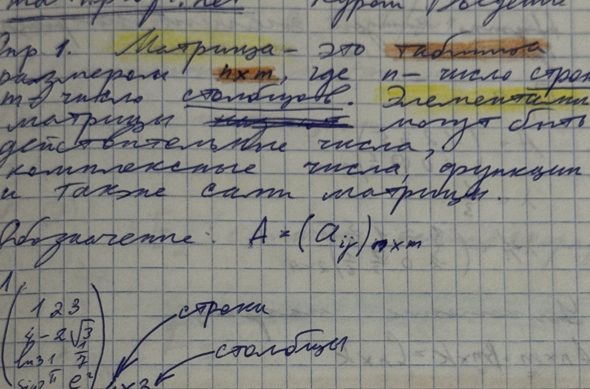
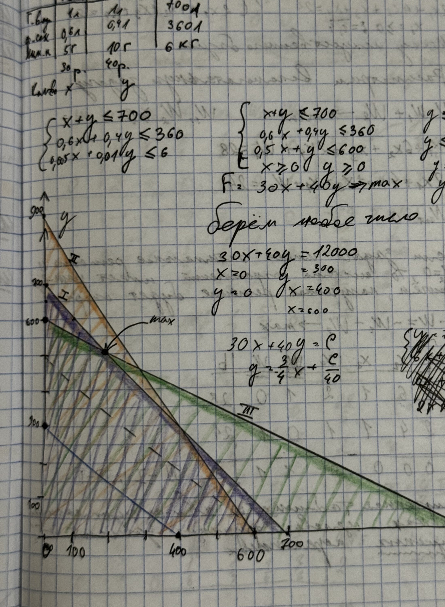
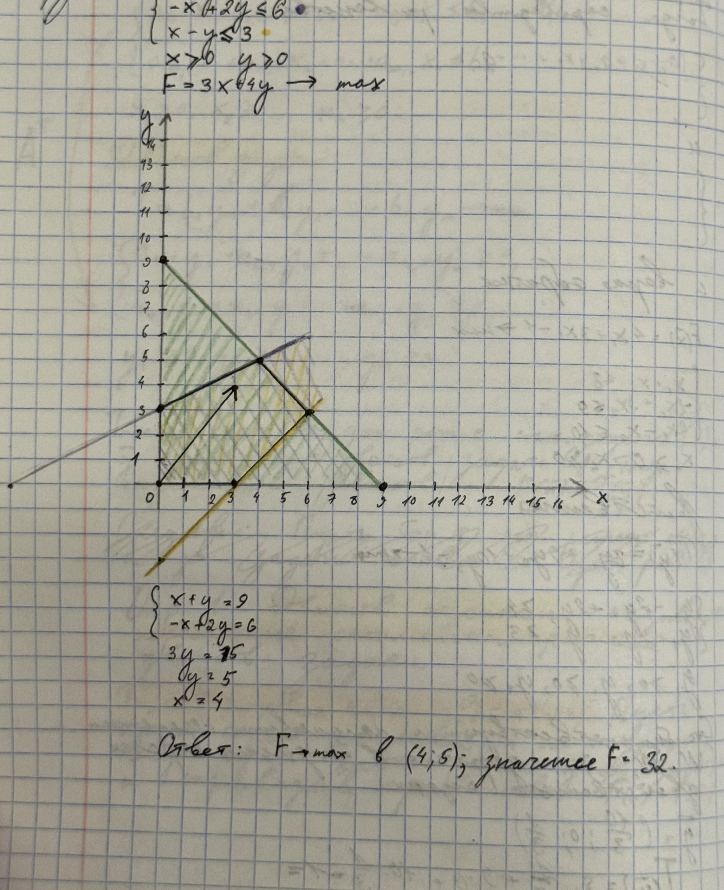
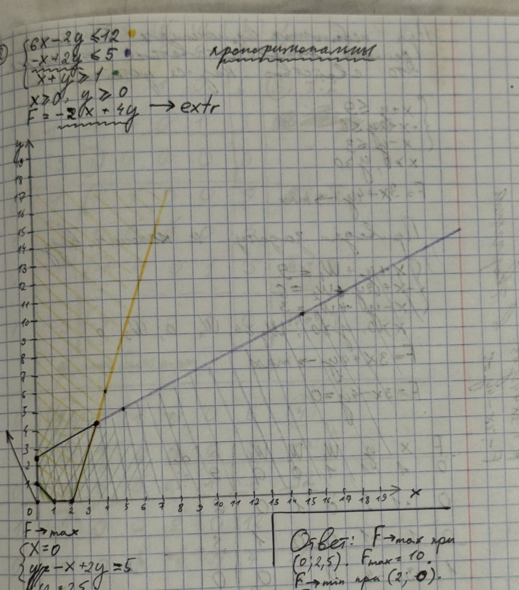
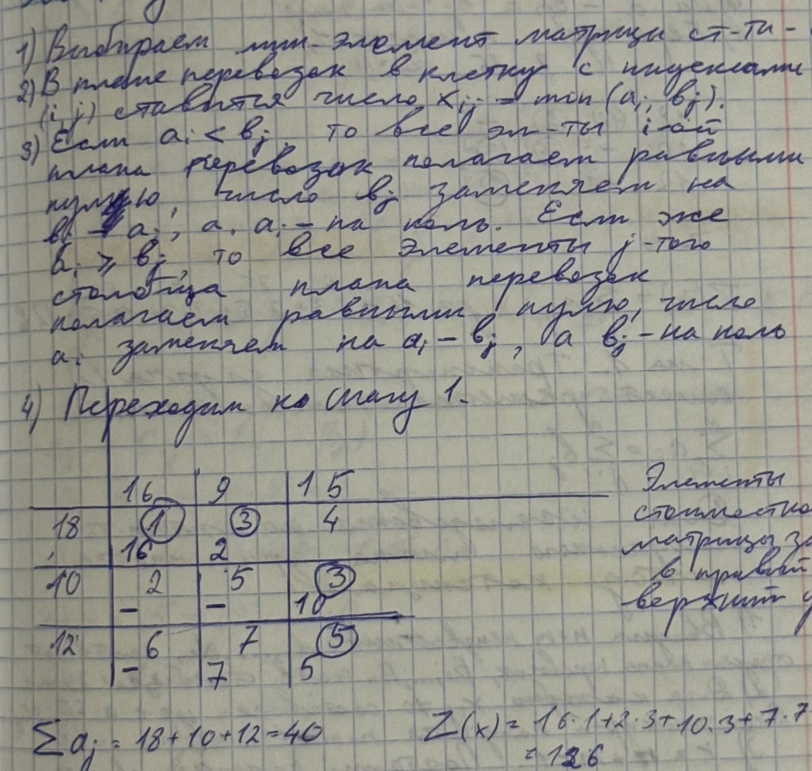

# Линейная алгебра

> Конспект собран из фотографий в тематическом порядке. Зачёркнутые и закрашенные записи не включены. Математическая запись оформлена в Obsidian-LaTeX.

## Оглавление

- [Матрицы и определители](#матрицы-и-определители)
- [Системы линейных уравнений и ранг](#системы-линейных-уравнений-и-ранг)
- [Векторные пространства и линейные операторы](#векторные-пространства-и-линейные-операторы)
- [Линейное программирование и симплекс-метод](#линейное-программирование-и-симплекс-метод)
- [Транспортная задача](#транспортная-задача)

---

## Матрицы и определители

### Теория

Матрица $A=(a_{ij})$ размера $m\times n$ содержит $m$ строк и $n$ столбцов. Матрицы равны только при одинаковом размере и совпадении всех соответствующих элементов.

**Операции над матрицами:**

$$
(A+B)_{ij}=a_{ij}+b_{ij},\qquad (\lambda A)_{ij}=\lambda a_{ij}.
$$

Произведение $A_{m\times n}B_{n\times k}$ существует, если число столбцов первой матрицы равно числу строк второй:

$$
(AB)_{ij}=\sum_{r=1}^{n}a_{ir}b_{rj}.
$$

В общем случае $AB\ne BA$. При этом

$$
(AB)C=A(BC),\qquad A(B+C)=AB+AC,\qquad (A+B)C=AC+BC.
$$

Для транспонирования выполняются правила

$$
(A+B)^T=A^T+B^T,\qquad (AB)^T=B^TA^T.
$$

Единичная матрица $E$ обладает свойством $AE=EA=A$. Квадратная матрица обратима тогда и только тогда, когда $\det A\ne0$:

$$
AA^{-1}=A^{-1}A=E,\qquad
A^{-1}=\frac{1}{\det A}\operatorname{adj}A.
$$

Для определителя второго порядка:

$$
\begin{vmatrix}a&b\\c&d\end{vmatrix}=ad-bc.
$$

Минор $M_{ij}$ получают вычёркиванием $i$-й строки и $j$-го столбца, а алгебраическое дополнение равно $A_{ij}=(-1)^{i+j}M_{ij}$. Разложение определителя по строке или столбцу:

$$
\det A=\sum_{j=1}^{n}a_{ij}A_{ij}.
$$

**Правила преобразования определителя:**

- перестановка двух строк меняет знак;
- умножение строки на $\lambda$ умножает определитель на $\lambda$;
- прибавление к строке кратной другой строки определитель не меняет;
- нулевая строка, одинаковые или пропорциональные строки дают нулевой определитель.

Также $\det A^T=\det A$ и $\det(AB)=\det A\det B$.

### Примеры

Матрицы, сложение и обозначения элементов показаны на первых листах темы.

*Фото IMG_6540 — определение матрицы, размеры и пример сложения матриц.*

**Поиск по исходным фото:** `IMG_6540` — матрицы и сложение; `IMG_6541` — умножение на число, произведение матриц и транспонирование; `IMG_6542` — единичная и обратная матрицы; `IMG_6543–IMG_6548` — коммутатор, определители, миноры и алгебраические дополнения; `IMG_6549–IMG_6553` — свойства определителя и вычисления.

---

## Системы линейных уравнений и ранг

### Теория

Систему линейных уравнений записывают в виде

$$
AX=b,
$$

а для метода Гаусса используют расширенную матрицу $[A\mid b]$. Допустимы элементарные преобразования строк:

1. перестановка двух строк;
2. умножение строки на ненулевое число;
3. прибавление к строке другой строки, умноженной на число.

**Метод Гаусса:** привести расширенную матрицу к ступенчатому виду, проверить совместность и выполнить обратную подстановку.

Ранг $\operatorname{rank}A$ — максимальный порядок ненулевого минора; в ступенчатой матрице он равен числу ненулевых строк. Элементарные преобразования строк ранг не меняют.

**Теорема Кронекера—Капелли:**

- если $\operatorname{rank}A\ne\operatorname{rank}[A\mid b]$, система несовместна;
- если ранги равны $n$, где $n$ — число неизвестных, решение единственное;
- если ранги равны, но меньше $n$, решений бесконечно много: часть переменных свободные.

Если $A$ квадратная и $\det A\ne0$, то $X=A^{-1}b$ — единственное решение.

### Примеры

В записях последовательно приведены приведение матриц к ступенчатому виду, проверка ранга, решение систем методом Гаусса и обратная подстановка.

**Поиск по исходным фото:** `IMG_6554` — матричная запись системы; `IMG_6555–IMG_6556` — ранг и элементарные преобразования; `IMG_6557–IMG_6561` — метод Гаусса и обратная подстановка; `IMG_6562–IMG_6568` — линейная зависимость и ранг расширенной матрицы; `IMG_6569–IMG_6581` — решения систем, канонический вид и матричные уравнения.

---

## Векторные пространства и линейные операторы

### Теория

Линейная комбинация векторов имеет вид

$$
\alpha_1v_1+\cdots+\alpha_kv_k.
$$

Векторы линейно независимы, если равенство $\alpha_1v_1+\cdots+\alpha_kv_k=0$ возможно только при нулевых коэффициентах. Базис — линейно независимая система, через которую выражается любой вектор пространства. Число векторов в базисе — размерность пространства.

Координаты вектора — коэффициенты его разложения по базису. Матрица перехода связывает координаты одного и другого базисов; при вычислении важно проверять направление перехода.

Для скалярного произведения и нормы:

$$
\langle x,y\rangle=\sum_i x_i y_i,\qquad
\lVert x\rVert=\sqrt{\langle x,x\rangle}.
$$

Векторы ортогональны, если $\langle x,y\rangle=0$.

Линейный оператор $T$ сохраняет линейные комбинации:

$$
T(\alpha x+\beta y)=\alpha T(x)+\beta T(y).
$$

Число $\lambda$ является собственным значением матрицы $A$, если для некоторого ненулевого $v$ выполняется $Av=\lambda v$. Алгоритм:

1. найти корни $det(A-\lambda E)=0$;
2. для каждого корня решить $(A-\lambda E)v=0$;
3. из ненулевых решений получить собственные векторы.

### Примеры

Записи включают линейные комбинации, координаты векторов, замену базиса, скалярное произведение, матрицы перехода и вычисления собственных значений.

**Поиск по исходным фото:** `IMG_6582–IMG_6584` — векторное пространство, координаты и скалярное произведение; `IMG_6585–IMG_6588` — линейные операторы, собственные значения и собственные векторы; `IMG_6589–IMG_6599` — операторы, матрицы перехода и матричные уравнения; `IMG_6600` — линейная комбинация и базис.

---

## Линейное программирование и симплекс-метод

### Теория

Задача линейного программирования содержит целевую функцию

$$
F=c_1x_1+\cdots+c_nx_n\to\max\ \text{или}\ \to\min,
$$

линейные ограничения и условия неотрицательности $x_i\ge0$.

**Графический метод для двух переменных:**

1. заменить каждое неравенство граничной прямой;
2. определить допустимые полуплоскости;
3. найти вершины пересечения;
4. вычислить целевую функцию в вершинах.

Если допустимая область непуста и оптимум конечен, он достигается хотя бы в одной из вершин. Направление роста линии уровня $c_1x+c_2y=C$ задаёт вектор $(c_1,c_2)$.

Для перехода к канонической форме в ограничение $\le$ добавляют переменную-запас, а в ограничении $\ge$ вычитают избыточную переменную. При отсутствии начального базиса используют искусственные переменные.

**Симплекс-метод:**

1. составить симплексную таблицу;
2. выбрать разрешающий столбец по оценкам целевой функции;
3. выбрать разрешающую строку по минимальному неотрицательному отношению $b_i/a_{ij}$ при $a_{ij}>0$;
4. преобразовать таблицу так, чтобы разрешающий элемент стал единицей, а остальные элементы его столбца — нулями;
5. повторять до выполнения критерия оптимальности для принятого знака оценок.

### Примеры

Производственная задача с ограничениями ресурсов и графическим поиском максимума:

$$
\begin{cases}
x+y\le700,\\
0{,}6x+0{,}4y\le360,\\
0{,}5x+y\le600,\\
x\ge0,\ y\ge0,
\end{cases}
\qquad F=30x+40y\to\max.
$$

*Фото IMG_6613 — допустимая область, граничные прямые и направление роста целевой функции.*

Задача на максимум с ответом $F_{\max}=32$ в точке $(4,5)$:

$$
\begin{cases}
x+y\le9,\\-x+2y\le6,\\x-y\le3,\\x\ge0,\ y\ge0,
\end{cases}
\qquad F=3x+4y\to\max.
$$

*Фото IMG_6622 — построение области допустимых решений и оптимальная вершина $(4,5)$.*

Задача на максимум и минимум:

$$
\begin{cases}
6x-2y\le12,\\-x+2y\le5,\\x+y\ge1,\\x\ge0,\ y\ge0,
\end{cases}
\qquad F=-2x+4y\to\operatorname{extr}.
$$

*Фото IMG_6623 — допустимая область задачи на экстремум; в записях отмечены $F_{\max}=10$ и $F_{\min}=-4$.*

**Поиск по исходным фото:** `IMG_6601–IMG_6609` — постановка задачи и графический метод; `IMG_6610–IMG_6612` — симплекс-метод и симплексная таблица; `IMG_6613–IMG_6619` — графический пример и табличные итерации; `IMG_6620–IMG_6627` — дополнительные графические и симплексные задачи.

---

## Транспортная задача

### Теория

Пусть поставщики имеют запасы $a_i$, потребители — спрос $b_j$, а $c_{ij}$ — стоимость перевозки единицы груза. План $x_{ij}$ должен удовлетворять

$$
\sum_jx_{ij}=a_i,\qquad \sum_ix_{ij}=b_j,\qquad x_{ij}\ge0,
$$

а стоимость минимизируется:

$$
Z=\sum_{i,j}c_{ij}x_{ij}\to\min.
$$

**Баланс:** закрытая задача удовлетворяет $\sum_i a_i=\sum_j b_j$. Если это не так, добавляют фиктивного поставщика или потребителя с недостающим объёмом и нулевыми тарифами.

**Начальный план:** его строят методом северо-западного угла или минимального элемента. В невырожденном базисном плане занято $m+n-1$ клеток; при меньшем числе используют нулевую поставку $\varepsilon$, не образующую цикл.

**Метод потенциалов.** Для занятых клеток находят потенциалы $u_i,v_j$:

$$
u_i+v_j=c_{ij}.
$$

Для свободных клеток вычисляют оценки

$$
\Delta_{ij}=c_{ij}-(u_i+v_j).
$$

В задаче минимизации все $\Delta_{ij}\ge0$ означают оптимальность плана. При отрицательной оценке строят цикл улучшения через занятие клетки, расставляют по циклу чередующиеся знаки $+$ и $-$ и переносят минимальную поставку из клеток со знаком $-$ в клетки со знаком $+$.

### Примеры

Пример первоначального плана методом минимального элемента. В записи сумма запасов равна сумме потребностей: $18+10+12=40$, а стоимость построенного плана указана как $Z(X)=126$.

*Фото IMG_6629 — транспортная таблица, метод минимального элемента и расчёт стоимости плана.*

**Поиск по исходным фото:** `IMG_6628` — модель транспортной задачи и условие баланса; `IMG_6629` — метод минимального элемента и таблица; `IMG_6630–IMG_6631` — метод потенциалов и оценки; `IMG_6632–IMG_6642` — цикл улучшения и дальнейшие табличные расчёты.

