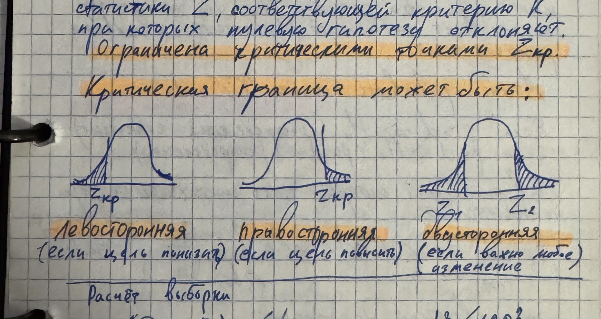

# Статистика в маркетинге

## Оглавление

- [[#Непараметрические критерии|Непараметрические критерии]]
- [[#Корреляционный и регрессионный анализ|Корреляционный и регрессионный анализ]]
- [[#Проверка гипотез|Проверка гипотез]]
- [[#Критерий согласия и доверительные интервалы|Критерий согласия и доверительные интервалы]]

## Непараметрические критерии

### Теория

Непараметрические критерии применяют, когда нельзя надёжно принять предположение о нормальном распределении, выборка мала или шкала данных не позволяет использовать параметрические методы.

==Непараметрические критерии не требуют нормальности распределения и подходят для ранговых или малых выборок.==

Основные примеры:

- критерий Манна—Уитни — сравнение двух независимых групп;
- критерий Уилкоксона — сравнение связанных измерений;
- ранговая корреляция Спирмена — монотонная связь между признаками;
- критерий Краскела—Уоллиса — сравнение более двух независимых групп.

### Примеры

Выбор критерия зависит от количества групп, зависимости наблюдений и типа шкалы. Для двух независимых групп с ненормальным распределением используют Манна—Уитни; для измерений «до/после» на одних объектах — Уилкоксона.

*Источник: IMG_6745 — непараметрические критерии, условия применения и ранговая связь.*

## Корреляционный и регрессионный анализ

### Теория

Коэффициент корреляции описывает направление и силу связи, но сам по себе не доказывает причинность. Для линейной связи количественных признаков используют корреляцию Пирсона; для рангов или выраженных выбросов — Спирмена.

==Корреляция не означает причинно-следственную связь.==

Регрессионная модель связывает зависимую переменную $y$ с факторами $x_1,\ldots,x_k$:

$$
y=\beta_0+\beta_1x_1+\cdots+\beta_kx_k+\varepsilon.
$$

Категориальный признак кодируют фиктивными переменными; одну категорию оставляют базовой, чтобы избежать полной мультиколлинеарности.

### Примеры

Для сезонной категории можно создать индикаторы «зима», «весна», «лето», оставив «осень» базовой. Тогда коэффициенты показывают отличие каждой категории от базы при прочих равных.

*Источник: IMG_6746 — корреляционный анализ, регрессия и dummy-кодирование категорий.*

## Проверка гипотез

### Теория

Формулируют нулевую гипотезу $H_0$ и альтернативную $H_1$, выбирают уровень значимости $\alpha$ и вычисляют статистику критерия или $p$-value.

==Если $p<\alpha$, нулевую гипотезу отвергают; если $p\ge\alpha$, оснований отвергать её недостаточно.==

- Ошибка I рода: отвергли истинную $H_0$; вероятность равна $\alpha$.
- Ошибка II рода: не отвергли ложную $H_0$; вероятность равна $\beta$.
- Мощность критерия: $1-\beta$.

Односторонняя гипотеза проверяет эффект в заданном направлении, двусторонняя — любое отличие. Практическую значимость дополнительно оценивают размером эффекта и доверительным интервалом.

### Примеры

*Фото IMG_6747 — области отклонения для левостороннего, правостороннего и двустороннего критериев.*

## Критерий согласия и доверительные интервалы

### Теория

Критерий $\chi^2$ используют для проверки согласия наблюдаемых частот с ожидаемыми и для проверки независимости категориальных признаков:

$$
\chi^2=\sum_i\frac{(O_i-E_i)^2}{E_i}.
$$

Доверительный интервал для среднего при известном стандартном отклонении генеральной совокупности:

$$
\bar x\pm z_{1-\alpha/2}\frac{\sigma}{\sqrt n}.
$$

Если $\sigma$ неизвестно, используют выборочное $s$ и $t$-распределение с $n-1$ степенями свободы.

### Примеры

Критерий согласия сравнивает распределение наблюдений с ожидаемым. Доверительный интервал показывает диапазон правдоподобных значений параметра, а не вероятность нахождения уже фиксированного параметра внутри конкретного рассчитанного интервала.

*Источник: IMG_6748 — критерий согласия $\chi^2$ и доверительные интервалы.*

## Карта источников

| Фото | Содержание |
|---|---|
| IMG_6745 | Непараметрические критерии и ранговые методы |
| IMG_6746 | Корреляция, регрессия, категориальные переменные |
| IMG_6747 | Гипотезы, ошибки, $p$-value и типы критерия |
| IMG_6748 | $\chi^2$ и доверительные интервалы |
