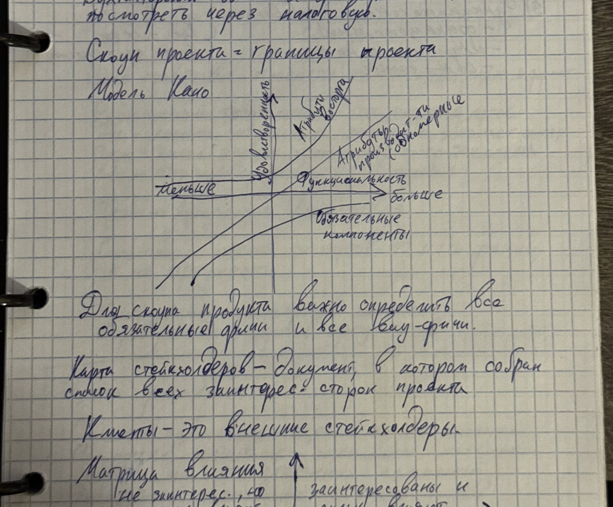
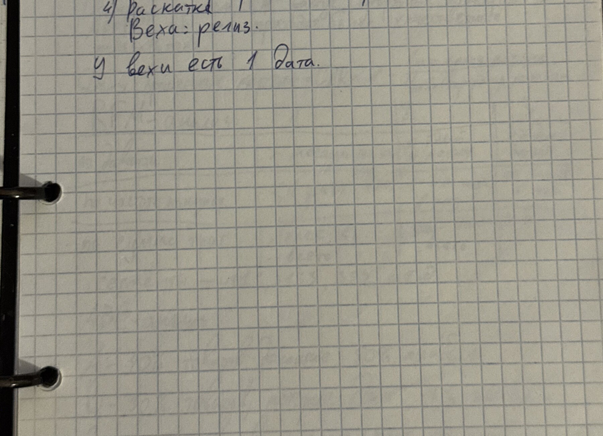

# Управление продуктом и проектами

## Оглавление

- [[#Требования и дизайн|Требования и дизайн]]
- [[#Ограничения проекта и качество|Ограничения проекта и качество]]
- [[#Оценка, аргументация и приоритизация|Оценка, аргументация и приоритизация]]
- [[#Риски и заинтересованные стороны|Риски и заинтересованные стороны]]
- [[#Сегментация ABC–XYZ|Сегментация ABC–XYZ]]

## Требования и дизайн

### Теория

Требование должно быть однозначным, проверяемым и связано с целью продукта. До реализации полезно уточнить пользователя, проблему, ожидаемый результат, ограничения и критерий приёмки.

==Сначала определить проблему и критерий успеха, затем выбирать решение.==

При анализе текста требований важно отделять факты, предположения и решения. Неясные слова заменять измеримыми условиями: вместо «быстро» — допустимое время ответа; вместо «удобно» — наблюдаемая пользовательская метрика.

### Примеры

Для веб-интерфейса критерий можно записать так: «95% запросов завершаются не дольше 2 секунд» и «пользователь выполняет основной сценарий не более чем за N шагов».

*Источники: IMG_6784 — анализ текста и правила формулирования; IMG_6786 — содержание и структура требований.*

## Ограничения проекта и качество

### Теория

Классическая модель ограничений связывает содержание, сроки, стоимость и качество. Изменение одного ограничения требует пересмотра других.

*Фото IMG_6785 — взаимосвязь времени, стоимости, содержания и качества проекта.*

Качество планируют через критерии приёмки, проверки и метрики. Стоимость исправления дефекта обычно растёт по мере продвижения к эксплуатации, поэтому ранняя проверка требований и прототипов дешевле поздней переработки.

### Примеры

*Фото IMG_6791 — график затрат на качество и потерь от дефектов.*

*Источники: IMG_6785–IMG_6786 — планирование проекта и ограничений; IMG_6791 — стоимость качества.*

## Оценка, аргументация и приоритизация

### Теория

Оценка проекта объединяет объём, ресурсы, сроки, риски и неопределённость. Лучше давать диапазон и явно записывать предположения, чем выдавать точечную оценку без условий.

==Аргумент состоит из тезиса, основания и связи между ними.==

Для приоритизации можно использовать ценность, трудоёмкость, риск и срочность. Важно заранее определить шкалы и не смешивать несопоставимые показатели без нормализации.

### Примеры

Для инициативы записать: проблема → целевой сегмент → эффект → метрика → стоимость → риск → зависимость. Затем сравнить инициативы по одной системе критериев.

*Источники: IMG_6787 — аргументация и оценка; IMG_6788–IMG_6790 — проектные расчёты, ресурсы и структура сметы.*

## Риски и заинтересованные стороны

### Теория

Риск описывают событием, вероятностью, воздействием, владельцем и реакцией. Базовые стратегии: избежать, снизить, передать или принять. Реестр рисков нужно пересматривать при изменении проекта.

Заинтересованные стороны различаются влиянием и интересом. Коммуникацию планируют с учётом обеих характеристик: кого держать в курсе, с кем согласовывать решения, кого вовлекать постоянно.

### Примеры

Для каждого риска зафиксировать триггер, превентивное действие и план на случай реализации. Для стейкхолдеров составить матрицу «влияние × интерес» и частоту коммуникаций.

*Источники: IMG_6790–IMG_6792 — риски, роли, структура сметы и работа со стейкхолдерами.*

## Сегментация ABC–XYZ

### Теория

ABC‑анализ делит объекты по вкладу в результат: группа A даёт наибольший вклад, C — наименьший. XYZ‑анализ делит по стабильности спроса или потребления: X — стабильные объекты, Z — наиболее нерегулярные.

==Комбинация ABC–XYZ помогает выбрать разные правила планирования для ценности и предсказуемости.==

### Примеры

- AX: высокий вклад и стабильность — строгий контроль наличия и точное планирование.
- AZ: высокий вклад, но нестабильность — запас безопасности и частый пересмотр прогноза.
- CX/CZ: низкий вклад — упрощённые правила управления, если нет иных ограничений.

*Источник: IMG_6793 — XYZ‑анализ и объединённая сегментация ABC–XYZ.*

## Карта источников

| Фото | Содержание |
|---|---|
| IMG_6784 | Работа с требованиями и текстом |
| IMG_6785 | Проектный треугольник и ограничения |
| IMG_6786 | Структура требований и планирование |
| IMG_6787 | Аргументация и оценка |
| IMG_6788 | Стоимость и организация проекта |
| IMG_6789 | Метрики проекта, ресурсы, ROI |
| IMG_6790 | Смета, риски и организация работ |
| IMG_6791 | Качество и затраты |
| IMG_6792 | Роли, команда и стейкхолдеры |
| IMG_6793 | ABC–XYZ‑сегментация |
